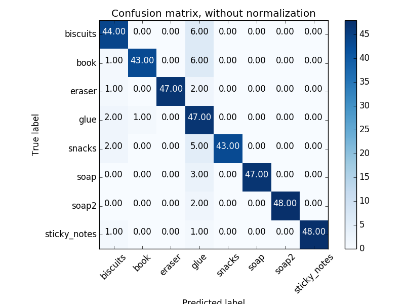
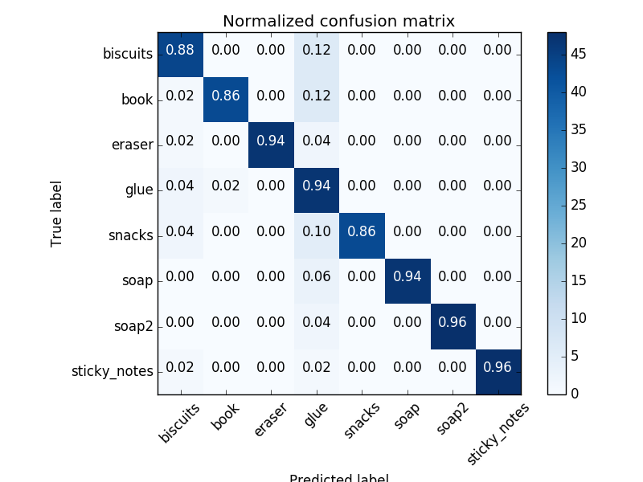
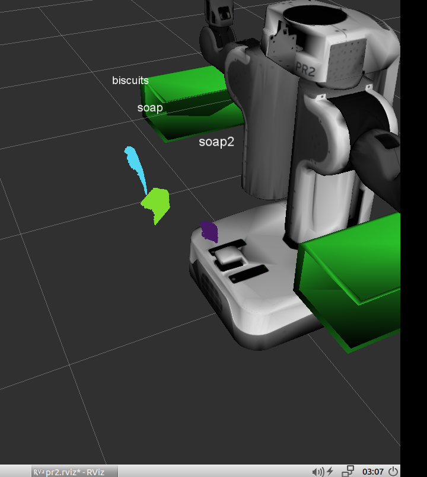

## Project: Perception Pick & Place

Attached is my perception pipeline script subscribing to `/pr2/world/points`, output_*.yamls, train_svm.py, features.py, and capture_features.py.  For training the models I changed the model list in capture_features.py and doubled the number of angles being trained per model to 10.  The kernel was also changed to RBF which gave more accuracy on the test set predictions. Next I will be purusing the extra challenges but wanted to get this submission in first for peace of mind!

Total Weight Confusion Chart:



Normalized Weight Confusion Chart:



Accuracy: 0.92 (+/- 0.06)

accuracy score: 0.9175


Pipeline in depth:

1.) I decreased the leaf_size to 0.005 for a more granular point cloud.
```
vox = cloud.make_voxel_grid_filter()
LEAF_SIZE = 0.005
vox.set_leaf_size(LEAF_SIZE, LEAF_SIZE, LEAF_SIZE)
```

2.) Two pass through filters were used.  One is about the same as the exercise's along the Z axis to filter out unused data below and above a certain threshold.  The 2nd I found useful to get rid of some of the clutter beyond the table.
Height Passthrough:
```
passthrough = cloud_filtered.make_passthrough_filter()
filter_axis = 'z'
passthrough.set_filter_field_name (filter_axis)
axis_min = 0.3
axis_max = .8
passthrough.set_filter_limits (axis_min, axis_max)
cloud_filtered = passthrough.filter()
```
Depth Passthrough:
```
passthrough = cloud_filtered.make_passthrough_filter()
filter_axis = 'x'
passthrough.set_filter_field_name (filter_axis)
axis_min = 0.3
axis_max = .7
passthrough.set_filter_limits (axis_min, axis_max)
cloud_filtered = passthrough.filter()
```

3.) K-Means outlier filter was run.  I experimented with a few numbers and found that a cluster of 50 with a distance of 0.04 greater than the Std of distances was adequate in filtering out the nice little sparkles around the table.
```
outlier_filter = cloud_filtered.make_statistical_outlier_filter()
# Set the number of neighboring points to analyze for any given point
outlier_filter.set_mean_k(50)
# Any point with a mean distance larger than global (mean distance+x*std_dev) will be considered outlier
x = .04
outlier_filter.set_std_dev_mul_thresh(x)
```
4.) A RANSAC filter was run to remove the plane from the point cloud (to eventually isolate the objects!).  A distance threshold of 0.02 was adequate in remove its contents.  I found the leaf size being smaller especially helpful here (allowed me to cut the margins on how close the points could be).
```
seg = cloud_filtered.make_segmenter()
seg.set_model_type(pcl.SACMODEL_PLANE)
seg.set_method_type(pcl.SAC_RANSAC)

seg.set_distance_threshold(0.02)
inliers, coefficients = seg.segment()
# negative=True means segmented object will be removed from the scene and the rest remains
extracted_inliers = cloud_filtered.extract(inliers, negative=True)
```

5.) Color was thrown out of the filtered point cloud we are now left with leaving only with position.  A KD-tree was constructed for quicker search and clustering.  The values used were the same as in exercise 3.
```
white_cloud = XYZRGB_to_XYZ(extracted_inliers)
tree = white_cloud.make_kdtree()
ec = white_cloud.make_EuclideanClusterExtraction()
ec.set_ClusterTolerance(.05)
ec.set_MinClusterSize(50)
ec.set_MaxClusterSize(5000)
# Search the k-d tree for clusters
ec.set_SearchMethod(tree)
# Extract indices for each of the discovered clusters
cluster_indices = ec.Extract()
```
6.) Each cluster was given a random color to distinguish when published to the appropriate ROS subscriber to view in RViz.
```
# utility function provides by the big boys
cluster_color = get_color_list(len(cluster_indices))

    color_cluster_point_list = []

    for j, indices in enumerate(cluster_indices):
        for i, indice in enumerate(indices):
            color_cluster_point_list.append([white_cloud[indice][0],
                                        white_cloud[indice][1],
                                        white_cloud[indice][2],
                                         rgb_to_float(cluster_color[j])])
    #Create new cloud containing all clusters, each with unique color
```

7.) All appropriate clouds were published (the colored objects, the filtered out plane,etc..)
```
# change to ROS appropriate format
ros_cloud_objects = pcl_to_ros(extracted_inliers)
ros_cloud_table = pcl_to_ros(cloud_filtered.extract(inliers, negative=False))
ros_cluster_cloud = pcl_to_ros(cluster_cloud)

# TODO: Publish ROS messages
pcl_objects_pub.publish(ros_cloud_objects)
pcl_table_pub.publish(ros_cloud_table)
pcl_cluster_pub.publish(ros_cluster_cloud)
```
8.) Classification and labeling took place using the trained classifier we made previously with capture_features.py and train_svm.py.  This was done specifically by computing the histogram data (color and normals) for each object remaining and running it through our trained ML model.
```
# Grab the points for the cluster (redundant, could've been done in loop above)
pcl_cluster = extracted_inliers.extract(pts_list)
ros_cluster = pcl_to_ros(pcl_cluster)
# Compute the associated feature vector
chists = compute_color_histograms(ros_cluster, using_hsv=True)
normals = get_normals(ros_cluster)
nhists = compute_normal_histograms(normals)
feature = np.concatenate((chists, nhists))
# Make the prediction
prediction = clf.predict(scaler.transform(feature.reshape(1,-1)))
label = encoder.inverse_transform(prediction)[0]

# Publish a label into RViz
label_pos = list(white_cloud[pts_list[0]])
label_pos[2] += .4
object_markers_pub.publish(make_label(label,label_pos, index))
```
9.) Object centroids were calculated
```
points_arr = ros_to_pcl(matching_obj.cloud).to_array()
centroid = np.mean(points_arr, axis=0)[:3]
```
10.) All relevant data was sent to the pick and place helper function to allow the PR2 to pick up the object and place it in one of the two available boxes!!!
```
# get dropbox to be used from central param server
dropbox = db_dict[obj_param['group']]

#set pickup position
pick_pos = Pose()
pick_pos.position.x, pick_pos.position.y, pick_pos.position.z = np.asscalar(centroid[0]), \
                                                                      np.asscalar(centroid[1]), \
                                                                      np.asscalar(centroid[2]) \

# get box position
place_pos = Pose()
place_pos.position.x, place_pos.position.y, place_pos.position.z = dropbox['position']

test_scene_num = Int32()
test_scene_num.data = 1
object_name = String()
object_name.data = param_label
arm_name = String()
arm_name.data = dropbox['name']
```

Sample Results From World 1:

